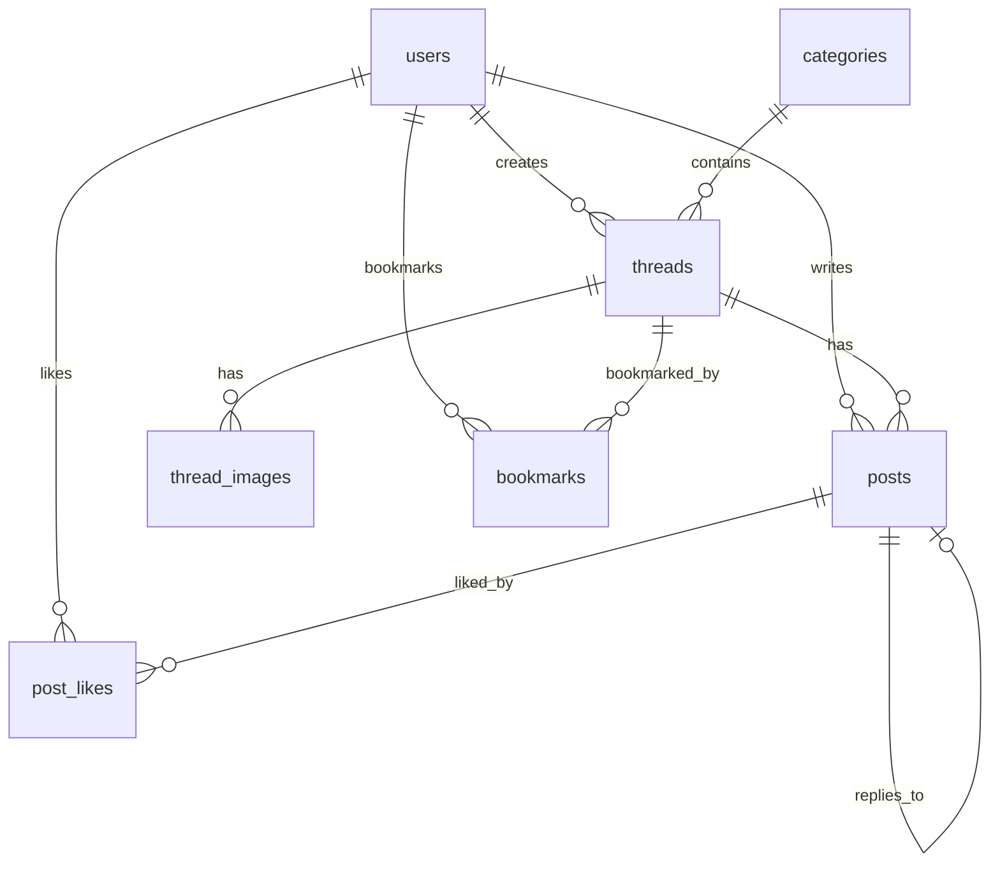

# Laravel学習用掲示板アプリ - データベース設計書

## 1. データベース概要

### 1.1 基本情報

- **DBMS**: MySQL 8.0
- **文字コード**: utf8mb4
- **照合順序**: utf8mb4_unicode_ci
- **タイムゾーン**: Asia/Tokyo

## 2. テーブル設計

### 2.1 users (ユーザー)

```sql
CREATE TABLE users (
    id BIGINT UNSIGNED AUTO_INCREMENT PRIMARY KEY,
    name VARCHAR(255) NOT NULL,
    email VARCHAR(255) NOT NULL UNIQUE,
    email_verified_at TIMESTAMP NULL,
    password VARCHAR(255) NOT NULL,
    avatar VARCHAR(255) NULL,
    bio TEXT NULL,
    is_admin BOOLEAN DEFAULT FALSE,
    banned_until TIMESTAMP NULL,
    last_activity_at TIMESTAMP NULL,
    remember_token VARCHAR(100) NULL,
    created_at TIMESTAMP NULL,
    updated_at TIMESTAMP NULL,

    INDEX idx_email (email),
    INDEX idx_banned (banned_until),
    INDEX idx_admin (is_admin)
);
```

### 2.2 categories (カテゴリー)

```sql
CREATE TABLE categories (
    id BIGINT UNSIGNED AUTO_INCREMENT PRIMARY KEY,
    name VARCHAR(100) NOT NULL,
    slug VARCHAR(100) NOT NULL UNIQUE,
    description TEXT NULL,
    color VARCHAR(7) DEFAULT '#000000',
    icon VARCHAR(50) NULL,
    sort_order INT DEFAULT 0,
    is_active BOOLEAN DEFAULT TRUE,
    created_at TIMESTAMP NULL,
    updated_at TIMESTAMP NULL,

    INDEX idx_slug (slug),
    INDEX idx_sort (sort_order),
    INDEX idx_active (is_active)
);
```

### 2.3 threads (スレッド)

```sql
CREATE TABLE threads (
    id BIGINT UNSIGNED AUTO_INCREMENT PRIMARY KEY,
    user_id BIGINT UNSIGNED NOT NULL,
    category_id BIGINT UNSIGNED NOT NULL,
    title VARCHAR(255) NOT NULL,
    body TEXT NOT NULL,
    view_count INT UNSIGNED DEFAULT 0,
    post_count INT UNSIGNED DEFAULT 0,
    is_pinned BOOLEAN DEFAULT FALSE,
    is_locked BOOLEAN DEFAULT FALSE,
    last_posted_at TIMESTAMP NULL,
    created_at TIMESTAMP NULL,
    updated_at TIMESTAMP NULL,
    deleted_at TIMESTAMP NULL,

    FOREIGN KEY (user_id) REFERENCES users(id) ON DELETE CASCADE,
    FOREIGN KEY (category_id) REFERENCES categories(id) ON DELETE RESTRICT,

    INDEX idx_user (user_id),
    INDEX idx_category (category_id, created_at),
    INDEX idx_last_posted (last_posted_at DESC),
    INDEX idx_pinned (is_pinned, created_at DESC),
    FULLTEXT idx_search (title, body)
);
```

### 2.4 posts (投稿)

```sql
CREATE TABLE posts (
    id BIGINT UNSIGNED AUTO_INCREMENT PRIMARY KEY,
    thread_id BIGINT UNSIGNED NOT NULL,
    user_id BIGINT UNSIGNED NOT NULL,
    reply_to_id BIGINT UNSIGNED NULL,
    content TEXT NOT NULL,
    is_edited BOOLEAN DEFAULT FALSE,
    edited_at TIMESTAMP NULL,
    created_at TIMESTAMP NULL,
    updated_at TIMESTAMP NULL,
    deleted_at TIMESTAMP NULL,

    FOREIGN KEY (thread_id) REFERENCES threads(id) ON DELETE CASCADE,
    FOREIGN KEY (user_id) REFERENCES users(id) ON DELETE CASCADE,
    FOREIGN KEY (reply_to_id) REFERENCES posts(id) ON DELETE SET NULL,

    INDEX idx_thread (thread_id, created_at),
    INDEX idx_user (user_id),
    INDEX idx_reply (reply_to_id)
);
```

### 2.5 thread_images (スレッド画像)

```sql
CREATE TABLE thread_images (
    id BIGINT UNSIGNED AUTO_INCREMENT PRIMARY KEY,
    thread_id BIGINT UNSIGNED NOT NULL,
    path VARCHAR(500) NOT NULL,
    filename VARCHAR(255) NOT NULL,
    mime_type VARCHAR(100) NOT NULL,
    size INT UNSIGNED NOT NULL,
    width INT UNSIGNED NULL,
    height INT UNSIGNED NULL,
    sort_order INT DEFAULT 0,
    created_at TIMESTAMP NULL,
    updated_at TIMESTAMP NULL,

    FOREIGN KEY (thread_id) REFERENCES threads(id) ON DELETE CASCADE,

    INDEX idx_thread (thread_id, sort_order)
);
```

### 2.6 bookmarks (ブックマーク) - 将来実装

```sql
CREATE TABLE bookmarks (
    id BIGINT UNSIGNED AUTO_INCREMENT PRIMARY KEY,
    user_id BIGINT UNSIGNED NOT NULL,
    thread_id BIGINT UNSIGNED NOT NULL,
    created_at TIMESTAMP NULL,

    FOREIGN KEY (user_id) REFERENCES users(id) ON DELETE CASCADE,
    FOREIGN KEY (thread_id) REFERENCES threads(id) ON DELETE CASCADE,

    UNIQUE KEY uk_user_thread (user_id, thread_id),
    INDEX idx_user (user_id, created_at DESC)
);
```

### 2.7 post_likes (いいね) - 将来実装

```sql
CREATE TABLE post_likes (
    id BIGINT UNSIGNED AUTO_INCREMENT PRIMARY KEY,
    user_id BIGINT UNSIGNED NOT NULL,
    post_id BIGINT UNSIGNED NOT NULL,
    created_at TIMESTAMP NULL,

    FOREIGN KEY (user_id) REFERENCES users(id) ON DELETE CASCADE,
    FOREIGN KEY (post_id) REFERENCES posts(id) ON DELETE CASCADE,

    UNIQUE KEY uk_user_post (user_id, post_id),
    INDEX idx_post (post_id)
);
```

## 3. リレーション図



## 4. インデックス設計方針

### 4.1 インデックス戦略

```yaml
Primary Keys:
  - すべてのテーブルにAUTO_INCREMENTのID

Foreign Keys:
  - 参照整合性の保証
  - JOINパフォーマンスの向上

Composite Indexes:
  - よく使われる検索条件の組み合わせ
  - ソート条件を含む

Full-Text Indexes:
  - スレッドタイトルと本文の全文検索
```

## 5. マイグレーション順序

```bash
1. 2024_01_01_000001_create_users_table.php
2. 2024_01_01_000002_create_categories_table.php
3. 2024_01_01_000003_create_threads_table.php
4. 2024_01_01_000004_create_posts_table.php
5. 2024_01_01_000005_create_thread_images_table.php
6. 2024_01_01_000006_create_bookmarks_table.php
7. 2024_01_01_000007_create_post_likes_table.php
```