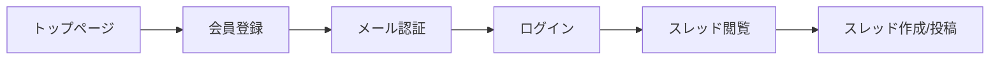
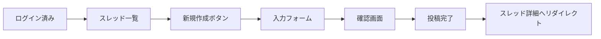
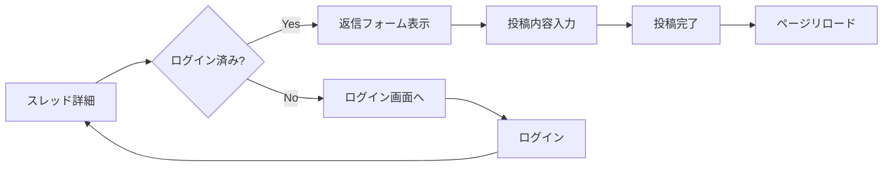

# Laravel学習用掲示板アプリ - サイトマップ

## 1. サイト構造

```
/
├── / (トップページ)
├── /login (ログイン)
├── /register (会員登録)
├── /password/reset (パスワードリセット)
├── /email/verify (メール認証)
│
├── /threads (スレッド一覧)
│   ├── /threads/create (スレッド作成) ※要認証
│   ├── /threads/{id} (スレッド詳細)
│   ├── /threads/{id}/edit (スレッド編集) ※作成者のみ
│   └── /threads/category/{slug} (カテゴリー別一覧)
│
├── /search (検索)
│   └── /search?q={keyword}&category={id} (検索結果)
│
├── /users/{id} (ユーザープロフィール)
│   ├── /users/{id}/threads (投稿スレッド一覧)
│   └── /users/{id}/posts (投稿履歴)
│
├── /profile (マイページ) ※要認証
│   ├── /profile/edit (プロフィール編集)
│   ├── /profile/threads (自分のスレッド)
│   ├── /profile/posts (自分の投稿)
│   └── /profile/bookmarks (ブックマーク) ※将来実装
│
├── /admin (管理画面) ※管理者のみ
│   ├── /admin/dashboard (ダッシュボード)
│   ├── /admin/users (ユーザー管理)
│   ├── /admin/threads (スレッド管理)
│   ├── /admin/categories (カテゴリー管理)
│   └── /admin/reports (通報管理) ※将来実装
│
├── /terms (利用規約)
├── /privacy (プライバシーポリシー)
└── /contact (お問い合わせ)
```

## 2. 画面詳細

### 2.1 公開エリア

#### トップページ (/)

```yaml
概要: 掲示板のランディングページ
内容:
  - 最新スレッド一覧（10件）
  - 人気カテゴリー表示
  - 検索ボックス
  - ログイン/会員登録へのリンク
認証: 不要
```

#### スレッド一覧 (/threads)

```yaml
概要: すべてのスレッドを表示
機能:
  - ページネーション（20件/ページ）
  - カテゴリーフィルター
  - ソート（新着順/投稿順/人気順）
  - 検索ボックス
認証: 不要（投稿は要認証）
```

#### スレッド詳細 (/threads/{id})

```yaml
概要: スレッドと投稿を表示
機能:
  - スレッド本文表示
  - 投稿一覧（ページネーション）
  - 返信フォーム（要認証）
  - アンカーリンク
  - 画像表示
認証: 閲覧は不要、投稿は要認証
```

#### 検索 (/search)

```yaml
概要: スレッド・投稿の検索
機能:
  - キーワード検索
  - カテゴリー絞り込み
  - 期間指定
  - 検索結果のハイライト
認証: 不要
```

### 2.2 認証エリア

#### ログイン (/login)

```yaml
フォーム:
  - メールアドレス
  - パスワード
  - Remember Me
  - パスワードを忘れた方へのリンク
```

#### 会員登録 (/register)

```yaml
フォーム:
  - 名前
  - メールアドレス
  - パスワード
  - パスワード確認
  - 利用規約への同意チェック
```

#### マイページ (/profile)

```yaml
概要: ログインユーザーの個人ページ
表示内容:
  - プロフィール情報
  - 投稿統計（スレッド数、投稿数）
  - 最近の活動
  - アバター画像
機能:
  - プロフィール編集へのリンク
  - 投稿履歴へのリンク
  - ブックマーク一覧（将来実装）
認証: 必須
```

#### プロフィール編集 (/profile/edit)

```yaml
フォーム:
  - 名前
  - メールアドレス
  - 自己紹介
  - アバター画像アップロード
  - パスワード変更
認証: 必須
```

### 2.3 管理エリア

#### 管理ダッシュボード (/admin/dashboard)

```yaml
概要: サイト統計と管理機能へのアクセス
表示内容:
  - ユーザー数統計
  - スレッド/投稿数統計
  - 新規登録グラフ
  - 最近の通報（将来実装）
アクセス権限: 管理者のみ
```

#### ユーザー管理 (/admin/users)

```yaml
機能:
  - ユーザー一覧表示
  - ユーザー検索
  - ユーザー詳細表示
  - BANの設定/解除
  - 管理者権限の付与/剥奪
アクセス権限: 管理者のみ
```

#### スレッド管理 (/admin/threads)

```yaml
機能:
  - スレッド一覧表示
  - スレッドの削除
  - スレッドのロック/アンロック
  - ピン留めの設定/解除
  - 不適切なコンテンツの削除
アクセス権限: 管理者のみ
```

#### カテゴリー管理 (/admin/categories)

```yaml
機能:
  - カテゴリー一覧
  - カテゴリーの追加/編集/削除
  - 表示順序の変更
  - アイコン/色の設定
アクセス権限: 管理者のみ
```

### 2.4 その他のページ

#### 利用規約 (/terms)

```yaml
内容:
  - サービス利用規約
  - 禁止事項
  - 免責事項
  - 準拠法
認証: 不要
```

#### プライバシーポリシー (/privacy)

```yaml
内容:
  - 個人情報の取り扱い
  - Cookieポリシー
  - 第三者提供について
  - お問い合わせ先
認証: 不要
```

#### お問い合わせ (/contact)

```yaml
フォーム:
  - お名前
  - メールアドレス
  - カテゴリー（不具合報告/要望/その他）
  - メッセージ
認証: 不要
```

## 3. ユーザーフロー

### 3.1 新規ユーザーフロー



### 3.2 スレッド作成フロー



### 3.3 投稿フロー



## 4. ナビゲーション構造

### 4.1 ヘッダーナビゲーション

```yaml
ゲストユーザー:
  - ロゴ（トップへ）
  - スレッド一覧
  - カテゴリー（ドロップダウン）
  - 検索ボックス
  - ログイン
  - 会員登録

ログインユーザー:
  - ロゴ（トップへ）
  - スレッド一覧
  - カテゴリー（ドロップダウン）
  - 検索ボックス
  - スレッド作成ボタン
  - 通知アイコン（将来実装）
  - ユーザーメニュー（ドロップダウン）
    - マイページ
    - プロフィール編集
    - ログアウト

管理者:
  - 上記に加えて
  - 管理画面へのリンク
```

### 4.2 フッターナビゲーション

```yaml
共通:
  - 利用規約
  - プライバシーポリシー
  - お問い合わせ
  - サイトマップ
  - RSS（将来実装）
  - Twitter/Facebook（将来実装）
```

### 4.3 サイドバー（スレッド一覧ページ）

```yaml
表示内容:
  - カテゴリー一覧
  - 人気のスレッド（Top 5）
  - 最近の投稿
  - タグクラウド（将来実装）
  - 広告スペース（将来実装）
```

## 5. レスポンシブ対応

### 5.1 ブレークポイント

```css
/* スマートフォン */
@media (max-width: 639px) {
  /* ハンバーガーメニュー表示 */
  /* 1カラムレイアウト */
}

/* タブレット */
@media (min-width: 640px) and (max-width: 1023px) {
  /* 2カラムレイアウト */
  /* サイドバー折りたたみ */
}

/* デスクトップ */
@media (min-width: 1024px) {
  /* 3カラムレイアウト */
  /* フル機能表示 */
}
```

### 5.2 モバイル最適化

```yaml
スマートフォン向け:
  - タッチフレンドリーなボタンサイズ（最小44px）
  - スワイプでのページ遷移（将来実装）
  - 画像の遅延読み込み
  - 無限スクロール（将来実装）
  - 簡略化されたフォーム

タブレット向け:
  - サイドバーのトグル表示
  - グリッドレイアウトの調整
  - モーダルウィンドウのサイズ調整
```

## 6. SEO構造

### 6.1 URL構造

```yaml
階層的URL:
  - /threads/category/tech (カテゴリー別)
  - /threads/2024/01 (年月アーカイブ・将来実装)
  - /users/1/threads (ユーザー別)

SEOフレンドリー:
  - 日本語URLは避ける
  - slugを使用（英数字とハイフン）
  - 適切な階層構造
```

### 6.2 メタデータ

```html
<!-- スレッド詳細ページの例 -->
<title>Laravelの学習方法について | Laravel掲示板</title>
<meta name="description" content="Laravelの効率的な学習方法について議論するスレッドです。初心者から上級者まで...">
<meta property="og:title" content="Laravelの学習方法について">
<meta property="og:description" content="Laravelの効率的な学習方法について...">
<meta property="og:image" content="/images/thread-1.jpg">
<meta property="og:url" content="https://example.com/threads/1">
<link rel="canonical" href="https://example.com/threads/1">
```

### 6.3 構造化データ（Schema.org）

```json
{
  "@context": "https://schema.org",
  "@type": "DiscussionForumPosting",
  "headline": "Laravelの学習方法について",
  "author": {
    "@type": "Person",
    "name": "山田太郎"
  },
  "datePublished": "2024-01-10T09:00:00+09:00",
  "articleBody": "Laravelの効率的な学習方法を..."
}
```

## 7. アクセシビリティ

### 7.1 WCAG 2.1準拠

```yaml
レベルA:
  - 適切な見出し構造（h1-h6）
  - alt属性の設定
  - フォームラベルの関連付け
  - キーボード操作対応

レベルAA:
  - カラーコントラスト比（4.5:1以上）
  - フォーカスインジケーター
  - エラーメッセージの明確化
  - レスポンシブデザイン
```

### 7.2 アクセシビリティ機能

```yaml
実装機能:
  - スキップリンク
  - ARIAラベル
  - セマンティックHTML
  - 適切なフォーカス管理
  - スクリーンリーダー対応
```

## 8. パフォーマンス目標

### 8.1 ページ読み込み時間

```yaml
目標値:
  - First Contentful Paint (FCP): < 1.8秒
  - Largest Contentful Paint (LCP): < 2.5秒
  - First Input Delay (FID): < 100ms
  - Cumulative Layout Shift (CLS): < 0.1
```

### 8.2 最適化施策

```yaml
実装予定:
  - 画像の最適化（WebP形式）
  - CSSとJavaScriptの最小化
  - Gzip圧縮
  - ブラウザキャッシュの活用
  - CDN利用（将来実装）
  - Critical CSSのインライン化
```
